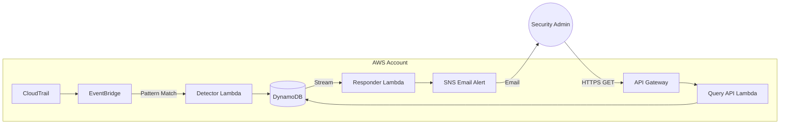

# 🛡️ CloudGuard Lite

> [!NOTE]
> **Prototype Version:** CloudGuard Lite is the v1 event-driven security detector prototype. For the production-grade v2 platform featuring automated remediation (SG revoking, S3 re-blocking, IAM MFA enforcement), AWS Config, Security Hub, and dual IaC (Terraform + Pulumi), see [cloudguard-pro](https://github.com/cypher682/cloudguard-pro).

> **Real-time serverless security monitoring for AWS — detecting suspicious activities across IAM and S3 with zero-infrastructure overhead.**

CloudGuard Lite is a production-style security tool that demonstrates a deep understanding of **Event-Driven Architecture (EDA)**, serverless security, and Infrastructure as Code. It monitors CloudTrail management events in real-time, filters for known attack patterns (ransomware indicators, persistence attempts, or logging evasion), and immediately alerts security teams via email.

---

## 🏗️ Architecture



### Technical Workflow
1. **Event Capture**: CloudTrail records management operations across the account.
2. **Detection**: Amazon EventBridge matches specific patterns (e.g., `StopLogging`, `DeleteBucket`) and triggers the **Detector Lambda**.
3. **Persistence**: The Detector parses the event metadata (Source IP, User Identity, Agent) and stores a normalized finding in **DynamoDB**.
4. **Automated Response**: A **DynamoDB Stream** triggers the **Responder Lambda** whenever a new finding is inserted.
5. **Notification**: The Responder publishes a formatted alert to an **SNS Topic**, reaching the administrator's inbox in seconds.
6. **Governance API**: A serverless REST API (API Gateway + Lambda) allows for programmatic retrieval and severity-based filtering of findings.

---

## ⚡ Key Features

| Feature | Description |
|---|---|
| **Real-time Detection** | Sub-minute latency from event occurrence to administrator alert. |
| **Serverless & Scalable** | Scalable from 1 to 10,000+ events per second with zero server management. |
| **Severity Scoring** | Automated severity classification (CRITICAL, HIGH, MEDIUM, LOW) based on risk. |
| **Operational Excellence** | Fully automated via **Terraform** including IAM least-privilege policies. |
| **Queryable Audit Trail** | REST API for listing findings with support for severity filtering via GSI. |

---

## 🛡️ Monitored Security Events

CloudGuard Lite is pre-configured to detect critical security maneuvers, including:

- **Evasion**: `StopLogging`, `DeleteTrail` (CRITICAL)
- **Persistence**: `CreateAccessKey`, `CreateUser`, `AttachUserPolicy` (HIGH/MEDIUM)
- **Exfiltration/Destruction**: `DeleteBucket`, `PutBucketAcl`, `PutBucketPolicy` (HIGH)
- **Monitoring Tampering**: `PutEventSelectors`, `DeleteBucketPolicy` (HIGH/MEDIUM)

---

## 🛠️ Technology Stack

| Layer | Technology |
|---|---|
| **Cloud Provider** | AWS (Regions: us-east-1 recommended) |
| **Compute** | AWS Lambda (Python 3.12) |
| **Event Bus** | Amazon EventBridge |
| **Database** | Amazon DynamoDB (with Streams & Global Secondary Index) |
| **API Gateway** | Amazon API Gateway (REST) |
| **Notifications** | Amazon SNS |
| **Infrastructure** | Terraform 1.14+ |

---

## 🚀 Deployment Guide

### Prerequisites
- AWS CLI configured with administrator access.
- Terraform installed locally.

### 1. Clone the repository
```bash
git clone https://github.com/cypher682/cloudguard-lite.git
cd cloudguard-lite
```

### 2. Provision Infrastructure
```bash
cd terraform
terraform init
terraform apply -var="alert_email=your-security@email.com"
```

### 3. Verify SNS Subscription
Check your email and click the **Confirm Subscription** link in the message from AWS SNS.

---

## 🧪 Testing the Detection Loop

You can simulate a "Persistence" attempt to verify the entire pipeline:

1. **Trigger Event**:
   ```bash
   aws iam create-user --user-name cloudguard-test-user
   ```
2. **Observe**:
   - Check the **Detector Lambda** logs in CloudWatch.
   - Wait ~10 seconds for the email alert in your inbox.
3. **Query API**:
   ```bash
   # Replace with the endpoint from Terraform output
   curl "https://<api-id>.execute-api.us-east-1.amazonaws.com/prod/findings?severity=MEDIUM"
   ```

---

## 📜 Security Design Notes

- **Least Privilege**: Every Lambda function uses a dedicated IAM Execution Role with access only to the specific DynamoDB table and SNS topic it needs.
- **Data Integrity**: DynamoDB is configured with on-demand scaling and point-in-time recovery.
- **Architecture Logic**: Using DynamoDB Streams for notifications decouples detection from alerting, ensuring a finding is saved even if notification fails.

---

## 👤 Author

**Suleiman Abdulrahman** — DevOps & Cloud Engineer  
[GitHub](https://github.com/cypher682) | [LinkedIn](https://linkedin.com/in/suleiman-abdulrahman-dev)
